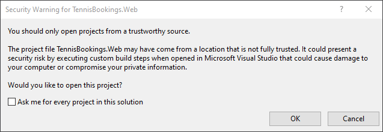
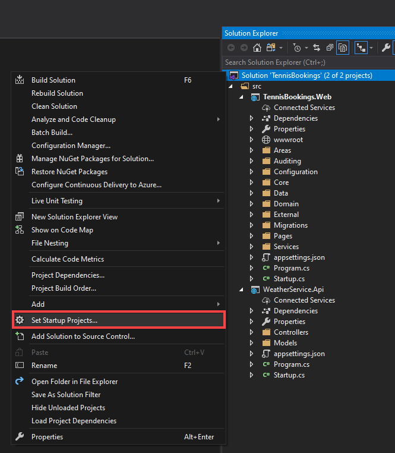
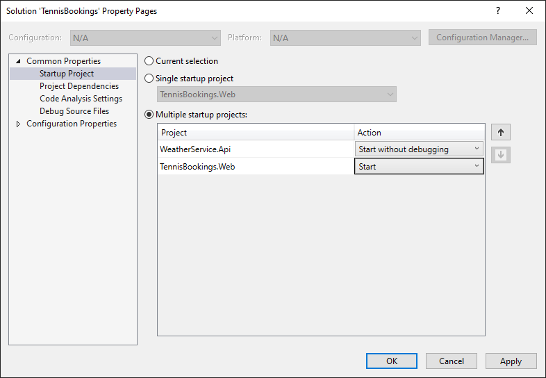
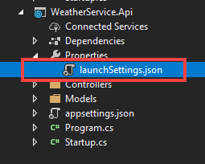
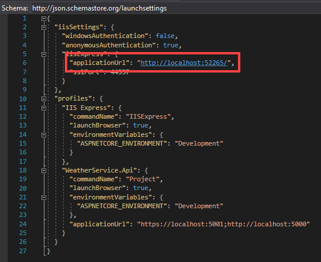
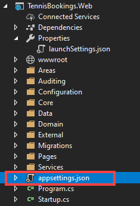
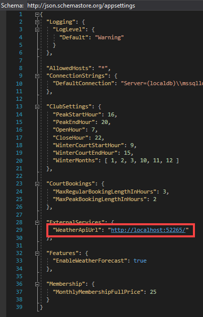

# Prerequisites

- .NET Core SDK 2.1+
- Visual Studio 2019 or alternative editor

# Configuration Steps Required to Run Sample

1: Open the TennisBookings.sln in Visual Studio.

*If prompted with a security warning, deselect "Ask me for ever project in this solution" and click "OK".*

2: Set multiple startup projects...

- Right click on the solution and choose "Set Startup Projects".

- Choose "Multiple startup projects"

Set `WeatherService.Api` as "Start without debugging" and `TennisBookings.Web` as "Start".

- Ensure `WeatherService.Api` is moved to the top of the list.

- Click "OK" to close the solution properties window.

3: Expand the `WeatherService.Api` project and open the "launchSettings.json" file.

4: Copy the auto-generated iisExpress application URL from the file.

5: Open the appSettings.json file inside the `TennisBookings.Web` application.

6: Paste the copied URL as the value for the "WeatherApiUrl" under "ExternalServices"

